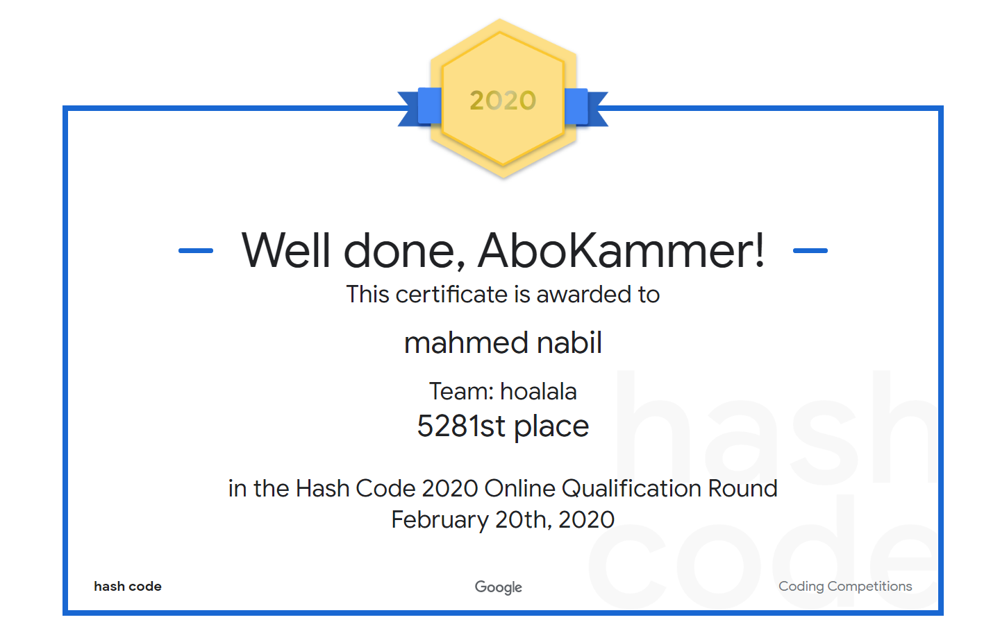

# MYCV

---

## Experience 
* Have a job experience with [Impulses-inc](http://impulses-i.epizy.com/home/home.php)  as a software engineer.

## Projects 
* impulses-inc site
* makeing an [iot-server](https://impulses-iot.herokuapp.com/login) for smart homes
* developing a [game](https://github.com/mahmednabil109/hearthstone-colne) as a project for my university GUC 

## Education
* computer science student at GUC
## Skils
* programming languages 

    java    | java script | python | jquery | html  | css
    -----   | ------------| -------| -------| ------| ---
    :star::star::star::star:|:star::star::star::star:|:star::star::star::star:|:star::star::star:|:star::star::star::star:|:star::star::star:

* have a programming solving skills 
    * have an [codeforces](https://codeforces.com/profile/mahmednabil109) and have solved over 200 problems
    * participate in google hashcode competition and have a [qualified certificate](https://codingcompetitions.withgoogle.com/hashcode/certificate/round/00000000001a006c)
    

---

    
    

